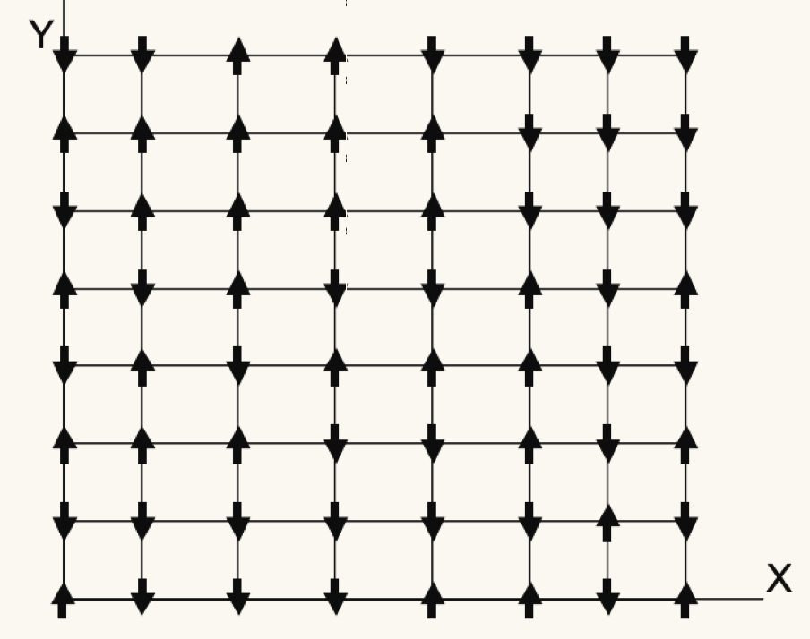

# Parallelize Replica Exchange MCMC Sampling 

## Introduction

### Overview
We designed and implemented an "HPC-version" of Replica Exchange MCMC sampling (Parallel Tempering) based on a hybrid of distributed memory processing and shared-memory processing with C++. In particular, the goal is to simulate an ensemble of Markov chains that exchange states regularly. Each chain is configured to sample a probability distribution (referred to as target distribution) at a certain *temperature*. We deploy two levels of parallelism: (i) each MPI process is used to simulate one or more chains in the ensemble where they exchange states through MPI point-to-point or collective communication; (ii) OpenMP treads are used to parallelize simulation of each step of each individual chain. We apply the resulting algorithm to two practical high-dimensional applications that are especially compute-intensive: (i) simulating two-dimensional square-lattice Ising model of interacting magnetic spins; (ii) decipher encrypted text. The experiments are run on Harvard Cannon computing cluster.

### The need for HPC
MCMC algorithm only provides an approximation of the correct sampling. One needs to run the underlying Markov chains sufficiently long to obtain accurate simulation. For high-dimensional problems, each step of the chain could take tens of thousands of float point operation and the chain itself often requires thousands of such steps to converge. For instance, simulating Ising model of moderate size (e.g. 64x64 lattice), each step of the Gibbs sampler requires 64x64x7=28672 floating point operations and convergence could take 10000+ steps. Application in cryptography exhibits similar demands for intensive computation. To exacerbate the problem, one single chain rarely offers optimal performance for such high dimensional problems. Practitioners often need to run an ensemble of S **communicating** Markov chains at different temperatures to attain satisfactory mixing at each temperature level. S ranges from 10 to 50 (or more). The computational burden is S-fold of a single Markov chain for serial implementation. 

## Problem description and comparison with existing work of parallelization
In this section, we give a succint account of two problems we seek to solve with Replica Exchange MCMC Sampling: (i) Simulating Ising lattice; (ii) decipher encrypted texts. 

### Statistical Mechanics: Simulating Ising Lattice
Consider a NxN matrix of entries of +1 or -1. This matrix is called an Ising lattice and each entry is a site of the lattice and +1, -1 denotes the site's spin. A spin configuration is an assignment of spin value to each lattice site.

A site has four neighbors: sites that is above, below, right, or left to it. For any two adjacent sites i,j, there is an interaction . The energy of a configuration   is given by the Hamiltonian function:

where the first sum is over pairs of adjacent spins. The magnetic moment is given by  The configuration probability is given by the Boltzmann distribution with inverse temperature 

where  is normalizing constant. The goal is now to draw sample from target distribution  for a range of temperature 

A common approach is to simulate dynamics of the Ising lattice at these temperatures simultaneously using Parallelize Replica Exchange MCMC Sampling where each chain (a Gibbs sampler) targets one temperature level. These chains exchange state frequently depending on the energy level of the entire ensemble so that the chains do not get stuck at local modes. Typically such simulation is computationally expensive for even moderate sized lattice. We consider running chains in the ensemble in parallel through MPI, and parallelizing each individual Gibbs sampler through strip-partition and chess-board-partition of the lattice square.

### Cryptograph: break a substitution cipher using 2-gram MCMC decipher

We consider the problem of decoding a paragraph of text encrypted through a substitution cipher. For example, we have a paragraph of text:

"*Tonight, we will break out of jail. The time we do this will be midnight. Tony and his men will be ready outside.*"

A substitution cipher works by replacing each character in this string with another character. Say, we replace "T" with "n", "o" with "S", "n" with "z", "i" with "&" and so forth. The coded text of this paragraph may look like "gibberish" such as the following: 

"*nSz&Kv&);DS&AKK;z;SKzMKM))0KzMKC)MMK0MLKk)v)U4amsdfUK!0)gSKDz_SKzx&SzU4KDzUK;DSKlz4KDzUK;DSKlz4KDzUK;Dasd*"

What each character in the original text corresponds to in the ciphered text is the key with which a ciphered paragraph may be recovered. The task of a deciphering algorithm is to find this key. For example, in our experiments, we restrict our attention to the 95 printable ASCII character. A ciphering key would be a permutation of these 95 character. To illustrate, consider 4 instead of 95 characters: "H, e, l, o". A permutation is "e, l, o, H". Then we can cipher "Hello" to "elooH". But once this permutation is uncovered, we can easily obtain the original text by reverse the permutation mapping. **There are a total of 95! ( roughly 10 to the power of 148) possible solutions!** So a naitve approach of trying out all possible keys simply do not work.

A strategy to search for the key is to use MCMC algorithm based on 2-gram frequency counts. In particular, we have a long reference text that is preferrably close to the ciphered text in terms of wording an context. For each pair of characters (e.g. "h" and "e"), we let  denote the number of times that each specific pair (e.g. "he") appear consecutively in the referenced text. Let's use x to denote a putative decryption key to the ciphered text. We then let  record the number of times that the pair appears when the cipher text is decrypted using the decryption key x. Consider the following score function

Informally,  here has the interpretation of the likelihood of the decrypted text is correct English (consider r as "true" transition probability from one character to the next). Intuitively, if a pair of character appears frequently in reference text, such pair should also appear frequently in the decrypted text provided that the decryption is correct. In short, we would like to sample from  to obtain keys that are likely to be correct and do some finer processing of the deciphered text. 

Parallelize Replica Exchange MCMC Sampling is often applied to sample  at different temperature . Each Markov chain follows a Metropolis Hasting algorithm (See below). Roughly speaking, each state of an Markov chain is a candidate decyphering key. It starts from a randomly generated permutation of the 95 ASCII characters and it proposes to take a step forward by permuting two of the characters. It decides if it will accept this proposal by evaluating . As we can see, evaluating  is computationally expensive: in our case, each step of the Markov chain involves 96*96*2=18432 floating point operations. We parallelize such evaluation with OpenMP reduction clause within each chain. Another level of parallelism is that we assign one or more chains to one MPI process. Using multiple chains starting at different candidate key is usually necessary since one single chain will likely be stuck at local mode. 

## Algorithms and Parallelization Strategy
We will first introduce replica exchange MCMC sampling and why a hybrid of distributed memory processing (MPI) and shared-memory processing (OpenMP) will be a particularly suitable solution for parallelization.

### Parallelize Individual MCMC Chains with OpenMP
The replica exchange MCMC sampling algorithm run S parallel Markov chains denoted as  at time t=1,2,.... Each step of a chain is referred to as a state and each state could be a number (one-dimensional), an n-array, or a n-by-n matrix. 

Each of these chains are set up to simulate a target distribution  at temperatures  respectively. To be specific, the i-th chain will simulate  by taking steps as *informed by *. There are two ways for each chain to *take a step* (i.e. moving from  to ):
1. Metropolis-Hasting kernel: the chain proposes a move to  uniformly around its current position  and accepts the move with probability . 
2. Gibbs kernel: in the case where each state of the chain is an array or a matrix, we may update each coordinate of the Markov chain state sequentially by the conditional distribution . 

#### Parallelize Gibbs sampler for Ising Model Example
For the Ising lattice application, each state is an N-by-N matrix. We consider two ways to parallelize the Gibbs updates: (i) partition the data matrix by strip; (ii) a checkboard decomposition.

The Gibbs updates for strip partition proceeds as follows:
1. Partition the entire Ising strip into S stripps horizontally and assign each strip to a parallel OpenMP threads;
2. Each OpenMP threads update its strip by sweeping through it row by row **with the exception of the last row**. Each entry is assigned +1 with probability  (otherwise assign -1) where  denotes sum of four neighboring sites of i;
3. An OpenMP barrier is placed until all threads have reached their last row (but has not updated it);
4. All OpenMP threads update the last rows of their strip.

The reason for this updating schedule is that each sites is dependent on the current value their four neighbors. So it is not possible to update all sites simultaneously at once. The last row of each strip is then left un-updated until the first row of the next strip has been updated by the other OpenMP thread. 

The checkerboard decomposition uses a more efficient partition scheme. The key observation is that each cell's updates depend only on its four neighboring cells (up, down, left and right). For this reason, all the black sites' update are independent of all the white sites and vice versa:

The updating schedule for checkerboard decomposition is therefore as follows:
1. Update all white sites in parallel using as many OpenMP threads as possible by the similar conditional probability rule: Each entry is assigned +1 with probability  (otherwise assign -1) where  denotes sum of four neighboring sites of i. Note that here each entry 
2. Then update all black sites while keeping white sites unchanged. 

#### Parallelize Metropolis Hasting kernel for cryptograph example
Recall that the goal is to sample from the target distribution  below:

To illustrate, we suppose that the state space (i.e. all candidate solutions) is permutation of (1,2,3,4). The actual implementation will deal with (1,2,...,95). 

The Metropolis Hasting algorithm proceeds as follows:
1. Each step the chain proposes to permute two entries in the list; for example, if the current state is (1,3,2,4), we may propose to permute 1,2 to obtain (2,3,1,4) as a proposal.
2. Compute  for both current and proposed move and compute acceptance ratio;
  
 The most computation-intensive part is to calculate  which involves a double loop of size 95x95. The parallelization is relatively easy. We simply apply OpenMP reduction clause to the loop.

### Parallelize Replica Exchange with MPI
In the last section, we discussed how to parallelize each individual chain in the ensemble through OpenMP. Now, we will explain how to run the Replica Exchange Sampling ensemble through MPI. 

First consider the following illustration for Replica Exchange MCMC Sampling:

The replica exchange MCMC sampling algorithm proceeds as follows:
1. There are S chains in the ensemble. Each chain runs either as Gibbs sampler or Metropolis Hasting sampler and will be parallelized through OpenMP. In particular, each chain targets a specific temperature level. This means that the target distribution for the i-th chain will be  where  is the i-th temperature;
2. Suppose that there are N nodes. Each node will be responsible for one or more chains;
3. The chains proceed independently for K steps then do an *exchange of states*. Such exchange of states is achieved by a proposal-acceptance procedure (i.e. Metropolis Hastings step). In particular, we may propose to exchange states of chain i and chain j. Suppose chain i (with temperature ) is at  and let , and analogously for chain j. The acceptance probability for the exchange is given by the following:

We use different exchange schedule for the Ising model application and the deciphering application. The Ising model example will following what we call a "shifting model". In particular, it proposes to exchange chain i and chain i+1 in a sequential fashion. At each iteration, MPI process running chain i+1 will send its state to the process running chain i and that process will compute  and  and determine whether to accept exchange. It will then send back its decision to the MPI process running chain i+1 along with state of chain i if the decision is to accept.

The deciphering application follows a "star model". In particular, the proposal will be to exchange chain 1 and chain i sequentially. The reason for doing this is that we would like chain 1 to be the solution key at the end. As a result, we would like to constantly check if other chains have obtained a more optimal solution.

The instruction to compile and run the project:

1. Clone the repo from github
2. Find the paths to mpicc and mpic++ compiler on your own machine by typing 

`$ which mpicc`

`$ which mpic++`

3. Go to root directory and modify the following lines in the CMakeList.txt file: replace "/usr/local/bin/mpicc" 
and "/usr/local/bin/mpic++" with the paths you find in step 2.

`set(CMAKE_C_COMPILER /usr/local/bin/mpicc)`

`set(CMAKE_CXX_COMPILER /usr/local/bin/mpic++)`

4. In the root directory, type

`$ cmake .`

`$ make`

5. Go to bin directory, type the following to run the code (with 2 tasks)

`$ mpirun -np 2 ./Denigma`

