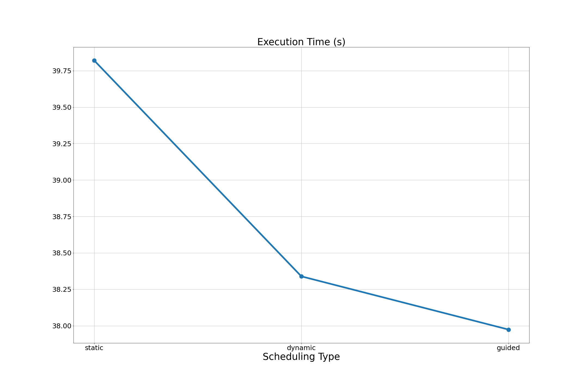
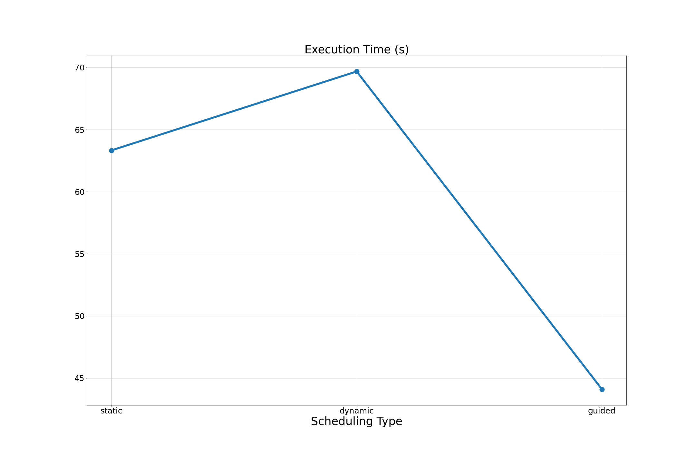

# Parallelize Replica Exchange MCMC Sampling 

## Introduction

### Overview
We designed and implemented an "HPC-version" of Replica Exchange MCMC sampling (Parallel Tempering) based on a hybrid of distributed memory processing and shared-memory processing with C++. In particular, the goal is to simulate an ensemble of Markov chains that exchange states regularly. Each chain is configured to sample a probability distribution (referred to as target distribution) at a certain *temperature*. We deploy two levels of parallelism: (i) each MPI process is used to simulate one or more chains in the ensemble where they exchange states through MPI point-to-point or collective communication; (ii) OpenMP threads are used to parallelize simulation of each step of each individual chain. We apply the resulting algorithm to two practical high-dimensional applications that are especially compute-intensive: (i) simulating two-dimensional square-lattice Ising model of interacting magnetic spins; (ii) decipher encrypted text. The experiments are run on Harvard Cannon computing cluster.

### The need for HPC
MCMC algorithm only provides an approximation of the correct sampling. One needs to run the underlying Markov chains sufficiently long to obtain accurate simulation. For high-dimensional problems, each step of the chain could take tens of thousands of float point operation and the chain itself often requires thousands of such steps to converge. For instance, simulating Ising model of moderate size (e.g. 64x64 lattice), each step of the Gibbs sampler requires 64x64x7=28672 floating point operations and convergence could take 10000+ steps. Application in cryptography exhibits similar demands for intensive computation. To exacerbate the problem, one single chain rarely offers optimal performance for such high dimensional problems. Practitioners often need to run an ensemble of S **communicating** Markov chains at different temperatures to attain satisfactory mixing at each temperature level. S ranges from 10 to 50 (or more). The computational burden is S-fold of a single Markov chain for serial implementation. 

## Problem Description 
In this section, we give a succinct account of two problems we seek to solve with Replica Exchange MCMC Sampling: (i) Simulating Ising lattice; (ii) decipher encrypted texts. 

### Statistical Mechanics: Simulating Ising Lattice
Consider a NxN matrix of entries of +1 or -1. This matrix is called an Ising lattice and each entry is a site of the lattice and +1, -1 denotes the site's spin. A spin configuration is an assignment of spin value to each lattice site.


A site has four neighbors: sites that is above, below, right, or left to it. For any two adjacent sites i,j, there is an interaction . The energy of a configuration   is given by the Hamiltonian function:


where the first sum is over pairs of adjacent spins. The magnetic moment is given by  The configuration probability is given by the Boltzmann distribution with inverse temperature 


where  is normalizing constant. The goal is now to draw sample from target distribution  for a range of temperature 

A common approach is to simulate dynamics of the Ising lattice at these temperatures simultaneously using Parallelize Replica Exchange MCMC Sampling where each chain (a Gibbs sampler) targets one temperature level. These chains exchange state frequently depending on the energy level of the entire ensemble so that the chains do not get stuck at local modes. Typically such simulation is computationally expensive for even moderate sized lattice. We consider running chains in the ensemble in parallel through MPI, and parallelizing each individual Gibbs sampler through strip-partition and chess-board-partition of the lattice square.

### Cryptograph: break a substitution cipher using 2-gram MCMC decipher

We consider the problem of decoding a paragraph of text encrypted through a substitution cipher. For example, we have a paragraph of text:

"*Tonight, we will break out of jail. The time we do this will be midnight. Tony and his men will be ready outside.*"

A substitution cipher works by replacing each character in this string with another character. Say, we replace "T" with "n", "o" with "S", "n" with "z", "i" with "&" and so forth. The coded text of this paragraph may look like "gibberish" such as the following: 

"*nSz&Kv&);DS&AKK;z;SKzMKM))0KzMKC)MMK0MLKk)v)U4amsdfUK!0)gSKDz_SKzx&SzU4KDzUK;DSKlz4KDzUK;DSKlz4KDzUK;Dasd*"

What each character in the original text corresponds to in the ciphered text is the key with which a ciphered paragraph may be recovered. The task of a deciphering algorithm is to find this key. For example, in our experiments, we restrict our attention to the 95 printable ASCII character. A ciphering key would be a permutation of these 95 character. To illustrate, consider 4 instead of 95 characters: "H, e, l, o". A permutation is "e, l, o, H". Then we can cipher "Hello" to "elooH". But once this permutation is uncovered, we can easily obtain the original text by reverse the permutation mapping. **There are a total of 95! ( roughly 10 to the power of 148) possible solutions!** So a naive approach of trying out all possible keys simply do not work.

A strategy to search for the key is to use MCMC algorithm based on 2-gram frequency counts. In particular, we have a long reference text that is preferably close to the ciphered text in terms of wording an context. For each pair of characters (e.g. "h" and "e"), we let  denote the number of times that each specific pair (e.g. "he") appear consecutively in the referenced text. Let's use x to denote a putative decryption key to the ciphered text. We then let  record the number of times that the pair appears when the cipher text is decrypted using the decryption key x. Consider the following score function


Informally,  here has the interpretation of the likelihood of the decrypted text is correct English (consider r as "true" transition probability from one character to the next). Intuitively, if a pair of character appears frequently in reference text, such pair should also appear frequently in the decrypted text provided that the decryption is correct. In short, we would like to sample from  to obtain keys that are likely to be correct and do some finer processing of the deciphered text. 

Parallelize Replica Exchange MCMC Sampling is often applied to sample  at different temperature . Each Markov chain follows a Metropolis Hasting algorithm (See below). Roughly speaking, each state of a Markov chain is a candidate deciphering key. It starts from a randomly generated permutation of the 95 ASCII characters and it proposes to take a step forward by permuting two of the characters. It decides if it will accept this proposal by evaluating . As we can see, evaluating  is computationally expensive: in our case, each step of the Markov chain involves 96\*96\*2=18432 floating point operations. We parallelize such evaluation with OpenMP reduction clause within each chain. Another level of parallelism is that we assign one or more chains to one MPI process. Using multiple chains starting at different candidate key is usually necessary since one single chain will likely be stuck at local mode. 


## Algorithm and Parallelization Application
We will first introduce replica exchange MCMC sampling and why a hybrid of distributed memory processing (MPI) and shared-memory processing (OpenMP) will be a particularly suitable solution for parallelization.

### Architectural Overview
The overall architecture is represented in the following diagram:


The overall procedure may be summarized as:
1. Assign S Markov chains to N MPI process where each process is hosted on one computing node; Ideally, each node run one Markov chain;
2. Each Markov chain target a specific temperature level of the target distribution (See details below);
3. Each MPI process run a chain through multiple OpenMP threads, parallelizing computation of target density or Gibbs update sites (See details below)
4. The Markov chains are run independently for K steps before they exchange states (See details below); this is repeated for T iterations

### Parallelize Individual MCMC Chains with OpenMP
The replica exchange MCMC sampling algorithm run S parallel Markov chains denoted as  at time t=1,2,.... Each step of a chain is referred to as a state and each state could be a number (one-dimensional), an n-array, or a n-by-n matrix. 

Each of these chains are set up to simulate a target distribution  at temperatures  respectively. To be specific, the i-th chain will simulate  by taking steps as *informed by *. There are two ways for each chain to *take a step* (i.e. moving from  to ):
1. Metropolis-Hasting kernel: the chain proposes a move to  uniformly around its current position  and accepts the move with probability . 
2. Gibbs kernel: in the case where each state of the chain is an array or a matrix, we may update each coordinate of the Markov chain state sequentially by the conditional distribution . 

#### Parallelize Gibbs sampler for Ising Model Example
For the Ising lattice application, each state is an N-by-N matrix. We consider two ways to parallelize the Gibbs updates: (i) partition the data matrix by strip; (ii) a checkboard decomposition.

The Gibbs updates for strip partition proceeds as follows:
1. Partition the entire Ising strip into S strips horizontally and assign each strip to a parallel OpenMP threads;
2. Each OpenMP threads update its strip by sweeping through it row by row **with the exception of the last row**. Each entry is assigned +1 with probability  (otherwise assign -1) where  denotes sum of four neighboring sites of i;
3. An OpenMP barrier is placed until all threads have reached their last row (but has not updated it);
4. All OpenMP threads update the last rows of their strip.


The reason for this updating schedule is that each site is dependent on the current value of their four neighbors. Therefore it is not possible to update all sites simultaneously at once. The last row of each strip is then left un-updated until the first row of the next strip has been updated by the other OpenMP thread. 

The checkerboard decomposition uses a more efficient partition scheme. The key observation is that each cell's updates depend only on its four neighboring cells (up, down, left and right). For this reason, all the black sites' updates are independent of all the white sites and vice versa:


The updating schedule for checkerboard decomposition is therefore as follows:
1. Update all white sites in parallel using as many OpenMP threads as possible by the similar conditional probability rule: Each entry is assigned +1 with probability  (otherwise assign -1) where  denotes sum of four neighboring sites of i. Note that here each entry 
2. Then update all black sites while keeping white sites unchanged. 

#### Parallelize Metropolis Hasting kernel for cryptograph example
Recall that the goal is to sample from the target distribution  below:


To illustrate, we suppose that the state space (i.e. all candidate solutions) is permutation of (1,2,3,4). The actual implementation will deal with (1,2,...,95). 

The Metropolis Hasting algorithm proceeds as follows:
1. Each step the chain proposes to permute two entries in the list; for example, if the current state is (1,3,2,4), we may propose to permute 1,2 to obtain (2,3,1,4) as a proposal.
2. Compute  for both current and proposed move and compute acceptance ratio;
  
 The most computation-intensive part is to calculate  which involves a double loop of size 95x95. The parallelization is relatively easy. We simply apply OpenMP reduction clause to the loop.


### Parallelize Replica Exchange with MPI
In the last section, we discussed how to parallelize each individual chain in the ensemble through OpenMP. Now, we will explain how to run the Replica Exchange Sampling ensemble through MPI. 

First consider the following illustration for Replica Exchange MCMC Sampling:


The replica exchange MCMC sampling algorithm proceeds as follows:
1. There are S chains in the ensemble. Each chain runs either as Gibbs sampler or Metropolis Hasting sampler and will be parallelized through OpenMP. In particular, each chain targets a specific temperature level. This means that the target distribution for the i-th chain will be  where  is the i-th temperature;
2. Suppose that there are N nodes. Each node will be responsible for one or more chains;
3. The chains proceed independently for K steps then do an *exchange of states*. Such exchange of states is achieved by a proposal-acceptance procedure (i.e. Metropolis Hastings step). In particular, we may propose to exchange states of chain i and chain j. Suppose chain i (with temperature ) is at  and let , and analogously for chain j. The acceptance probability for the exchange is given by the following:


We use different exchange schedule for the Ising model application and the deciphering application. The Ising model example will following what we call a "shifting model". In particular, it proposes to exchange chain i and chain i+1 in a sequential fashion. At each iteration, MPI process running chain i+1 will send its state to the process running chain i and that process will compute  and  and determine whether to accept exchange. It will then send back its decision to the MPI process running chain i+1 along with state of chain i if the decision is to accept.

The deciphering application follows a "star model". In particular, the proposal will be to exchange chain 1 and chain i sequentially. The reason for doing this is that we would like chain 1 to be the solution key at the end. As a result, we would like to constantly check if other chains have obtained a more optimal solution.

## Comparison with existing work of parallelization
There are many works on parallelization of Ising lattice simulation: most commonly researchers experiment accelerating full sweep of Gibbs sampling of Ising lattice via OpenMP threads or GPU. For the former, see [1][2]. For the latter, see [3][4][5]. The hybrid parallelization implementation is relatively scarce and the existing solutions do not leverage MPI level of parallelization for the purpose of running replica exchange MCMC chains--they simply use MPI parallelization for the compute partitions of a massive Ising lattice (see [6]). Parallelization for MCMC deciphering is not of widespread interest and there are few papers discussing parallelization strategies. That said, existing solutions do mostly use replica exchange MCMC which is straightforward to implement in parallel: see [7], [8]. They generally do not explicitly leverage HPC techniques in their implementation and currently available implementations on internet is mostly sequential: e.g. [9] [10].  There are also works that discuss parallelization of replica exchange MCMC in general: [11] [12]. But they do not specifically test their methods on the two applications we consider here. 


## Reproduction Instructions and System Specification
This code may be run on local machine or a cluster. Please check the dependencies below. 

**Since the code was mainly tested on CANNON computing cluster at Harvard FAS Research computing, we strongly recommend the teaching team grades the project on Cannon. We will provide detailed instructions to set up the project on Cannon below.**


### Operating System and distribution
Our testing is done on Linux system (CentOS) but it should also work with Mac OS once one has the required compiler and MPI installed.

```
  Operating System: CentOS Linux 7 (Core)
       CPE OS Name: cpe:/o:centos:centos:7
            Kernel: Linux 3.10.0-957.12.1.el7.x86_64
```

### Compiler and MPI
You must have Intel or GCC compiler that supports OpenMP (the "-fopenmp" tag). For this project, we will use GCC of the following version:
```
Thread model: posix
gcc version 9.2.0 (GCC) 
```

We use Open MPI of the following version for this project:
```
(Open MPI) 4.0.2
```

It is also required that cmake is installed on the system:
```
cmake version 2.8.12.2
```

These softwares may be loaded on Cannon Cluster through the following command:
```
module load gcc/9.2.0-fasrc01 openmpi/4.0.2-fasrc01
```

Or if one prefers to use Intel C compiler (better OpenMP threads affinity support):
```
module load intel/19.0.5-fasrc01 openmpi/4.0.1-fasrc01
```

### Hardware Architecture
The following information is provided at the Harvard FAS research computing website: 

"The new Cannon cluster is primarily comprised of 670 Lenovo SD650 NeXtScale servers, part of their new liquid-cooled Neptune line. Each chassis unit contains two nodes, each containing two Intel 8268 "Cascade Lake" processors and 192GB RAM per node. The nodes are interconnected by HDR 100 Gbps Infiniband (IB) in a single Fat Tree with a 200 Gbps IB core. "

In particular, the CPU information of each node is given below:

```
lscpu
Architecture:          x86_64
CPU op-mode(s):        32-bit, 64-bit
Byte Order:            Little Endian
CPU(s):                48
On-line CPU(s) list:   0-47
Thread(s) per core:    1
Core(s) per socket:    24
Socket(s):             2
NUMA node(s):          2
Vendor ID:             GenuineIntel
CPU family:            6
Model:                 85
Model name:            Intel(R) Xeon(R) Platinum 8268 CPU @ 2.90GHz
Stepping:              7
CPU MHz:               1199.896
CPU max MHz:           3900.0000
CPU min MHz:           1200.0000
BogoMIPS:              5800.00
Virtualization:        VT-x
L1d cache:             32K
L1i cache:             32K
L2 cache:              1024K
L3 cache:              36608K
NUMA node0 CPU(s):     0-23
NUMA node1 CPU(s):     24-47
```

To request nodes, one can either initiate an interactive mode where one can interact with the requested resource or submit a job through slurm batch file. Our experiment is conducted in the interactive mode where the following line is used to request resources:

```
srun -p test -n 8 -N 8 -c 12 --pty --mem 1000 -t 0-06:00 /bin/bash
```

This corresponds to 8 tasks on 8 nodes where each node is equipped with 12 CPUs (i.e. maximum 12 OpenMP threads per node). 


### The instruction to compile and run the project:

1. Log into your Cannon account if you intend to run it on cannon. First request nodes and then load modules as in the last section. Then clone the repo from github:

```
$ git clone https://github.com/liyufan1994/CS205ParallelMCMC.git
```

2. Find the paths to mpicc and mpic++ compiler on your own machine by typing 

```
$ which mpicc
```

```
$ which mpic++
```

3. Go to root directory and modify the following lines in the CMakeLists.txt file: replace them with the paths you find in step 2. This is basically redirecting path to correct location of your mpicc mpic++ compiler. 

```
set(CMAKE_C_COMPILER /n/helmod/apps/centos7/Comp/gcc/9.2.0-fasrc01/openmpi/4.0.2-fasrc01/bin/mpicc)
set(CMAKE_CXX_COMPILER /n/helmod/apps/centos7/Comp/gcc/9.2.0-fasrc01/openmpi/4.0.2-fasrc01/bin/mpic++)
```

4. In the root directory, type

```
$ cmake .
```

```
$ make
```


5. Go to bin directory, you will find the following two executables; Ising is the executable for Ising model application whereas Denigma is the executable for decryption application

```
Ising
```

```
Denigma
```

6. Type the following to run the code (with 4 tasks)

```
$ mpirun -np 4 ./Denigma 1
```

```
$ mpirun -np 4 ./Ising 32 1 1
```
Denigma is executable for deciphering application: the argument is number of Markov chains per MPI process. Ising is executable for Ising model application: the first argument is side length of Ising lattice to simulate (32 here), second argument is number of Markov chains per MPI process, third argument is type of OpenMP decomposition (0 is strip patter, 1 is checkerboard pattern)

7. One may alter number of OpenMP threads by setting OMP_NUM_THREAD environment variable before mpirun;

```
$ export OMP_NUM_THREADS=6
```


8. One may adjust OpenMP NUMA thread affinity by setting KMP_AFFINITY environment variable (for Intel compiler) or GOMP_CPU_AFFINITY (for GCC). For example,

```
$ export GOMP_CPU_AFFINITY="0-5"
```

```
$ export KMP_AFFINITY=verbose,compact
```

### Code Profiling
To inspect which part of the code takes the most amount of time to run, we use `gprof` to collect timing information for each of our functions.

1. First, to use `gprof`, we should compile and link the code with the -pg option by editing the CMakeLists.txt file in the root directory. 

```
set(CMAKE_C_FLAGS "${CMAKE_C_FLAGS} ${OpenMP_C_FLAGS} -pg")
set(CMAKE_CXX_FLAGS "${CMAKE_CXX_FLAGS} ${OpenMP_CXX_FLAGS} -pg")
set(CMAKE_EXE_LINKER_FLAGS "${CMAKE_EXE_LINKER_FLAGS} ${OpenMP_EXE_LINKER_FLAGS} -pg")
```
and 

```
set(CMAKE_CXX_FLAGS "-fopenmp -pg")
set(CMAKE_C_FLAGS "-fopenmp -pg")
``` 

2. Second, compile the code and then go to the bin directory to run the program normally.

```
$ mpirun -np 4 ./Denigma
$ mpirun -np 4 ./Ising
```

3. Third, type `gprof exec > out` where exec is our executable's name and out is the output file's name. Specifically, we use

```
$ gprof ./Denigma > Denigma.stats
```

```
$ gprof ./Ising > Ising.stats
```

or we would find a generated `gmon.out` file in the bin folder and we can use the following syntax to generate code profiling output

```
$ gprof ./Denigma gmon.out> Denigma.stats
```

```
$ gprof ./Ising gmon.out > Ising.stats
```
The timing information is recorded in the outputs. The second table in the output file is more informative.


## Theoretical Complexity and speedup
Suppose that we need to run S concurrent, communicating Markov chains for a total of T steps, and that each step requires N computation (for either acceptance ratio or Gibbs sweep). Then the computing complexity is O(T\*S\*N). For the Ising model, the N is the size of the Ising lattices whereas for deciphering application, N is square of number of characters to encode/decode. 

Suppose our parallelization solution uses R MPI nodes whereas each node uses M OpenMP threads. Then the theoretic speedup is R\*M. Then the theoretic complexity of the parallel algorithm is O(T\*S\*N/M\*R). 

## Overheads and Mitigation Strategy
Generally speaking, the overheads come from two levels of parallelization: 

1. Synchronization and communication of MPI processes;
2. Synchronization of OpenMP threads.

Our first strategy to mitigate MPI overheads is to reduce frequency of MPI exchanges from once pre step for usual parallel tempering algorithm to once per several steps. This modification is motivated by the realization that parallel exchanges are mainly for the purpose of bringing Markov chains at low temperature out of their local maxima. Therefore, reducing frequency of exchanges will not have a great impact on the overall performance of the algorithm. 

The second strategy to mitigate MPI overheads is to modify exchange schedule according to the specific application: for Ising model, we only propose to exchange to neighboring chains--this is because the probability for two chains with large temperature difference to be accepted is slim. For the deciphering example, we only propose to exchange the first chains with other chains where the chain to be exchanged with the first chain is determined through a deterministic scan. The point is that we would like to output the maximum-likelihood solution found by just the first chain and it will keep picking up the most optimal solutions found by all the other chains (randomly started at various places) and refine the search locally. 

To mitigate synchronization of OpenMP threads, we allow the user to choose strip pattern or checkerboard pattern decomposition. The strip pattern simply chops the lattice into several blocks and assign them to OpenMP threads. As a result, strip pattern outperforms checkboard's performance (see performance evaluation section below) when there are relatively few OpenMP treads and each Ising lattice partition block is large. On the other hand, since each strip needs to contain at least two rows, there cannot be too many OpenMP threads at once. Checkerboard pattern however can accommodate a large number of parallel threads and is more suitable for relatively small lattice. 


## Software Design
### Directory structure, executables and shared libraries
The source code is located within the src folder whereas the common utility libraries are compiled into lib folder where libArrayUtils.so includes utility functions for array operations and libSamplingUtils.so includes utility functions for sampling and randomization. 

The executables are Ising and Denigma whereas the former is executable for the Ising application and the latter is executable for the deciphering application. They are included in the bin folder. 

The input files (texts to decipher and intermediate deciphering texts) are located in the "data" folder.

### Code Structure
We opted to not use object-oriented-programming (OOP) but to use "scripting" because the application is largely procedural and focuses on computation. OOP may also affect computing performance. 

The main function for Ising model application located in Ising.cpp. The main function for deciphering application located in decipher.cpp. Main functions parse user arguments and calls modules that process inputs and outputs as well as deploying the main computational module: "ParallelChains". This function implements the replica exchange MCMC logic and associated MPI exchange logic. It also evaluates target density function by a helper function ("OneChainIsing" for Ising model and "logtarget" for decryption); the helper function uses OpenMP to parallelize computation required for each step of the chain. Utility functions such as array operations and randomizations are implemented as shared libraries. 


## Advanced Features
The two-level hybrid parallelization architecture is novel and in our opinion is especially appropriate for replica exchange MCMC algorithm. The course (e.g. last problem in HW2) has explored parallelizing a problem on hybrid architectures but the way the algorithm is decomposed to parallel computing units does not really differ across level of parallelism. Our solution to decompose the problem at two different dimensions (across different Markov chains and computation within each step of each chain) has not been explored in the course.  We also explored different exchange strategy appropriate for each application where the Ising model uses neighboring exchange and deciphering application uses "centralized, systematic" scans in search for optimal solution. 

On the OpenMP level, we explored two relatively sophisticated strategies to partition the lattice that use different stages of updates on one single sweep of the lattice. This adds to the "padding" techniques explored in the course. That is, as an alternative to "padding", we decouple the dependencies of different partition blocks of the lattice by introducing two stages of updates where updates within each stage are applied to sites that are independent of the other partition blocks. We implemented two decomposition schemes (the strip pattern and checkerboard pattern) that have different strength and weakness when it comes to parallel computing. These patterns are typical to matrix/lattice decomposition in HPC but have not been covered in the course in detail. 


## Performance Evaluation 
We apply the paralleled replica exchange MCMC algorithm to two different problems: Ising lattice simulation and decryption. The purpose of testing the algorithm of two problems (as opposed to one) is that these two problems tend to reflect different aspects of the performance of the algorithm. For the Ising model, we focus on testing raw computing speed and scalability of the algorithm as we increase the problem size (size of the lattice and number of chains in the ensemble). For the decryption problem, we can explicitly evaluate improvement of decryption accuracy under fixed time budget--with MPI-level parallelization we can run more chains to broaden our search and avoid minima trap whereas with OpenMP-level parallelization we can run longer chains to make the search more thorough. 

### Ising Model

#### Experiment Set-up and Benchmark
The experiment setup is the following: we have a NxN 2D Ising lattice and we run a replica exchange MCMC algorithm of S parallel Markov chains. Temperature level is set to be equal intervals between 0.3 to 0.6 where so that the temperature of the first chain is 0.6, second chain 0.6-(0.6-0.3)/S, the third chain 0.6-2x(0.6-0.3)/S and so forth. For this particular application, we propose to exchange two chains every time we complete a full sweep of the Ising square. We run the chains for just 100 full sweeps for the purpose of testing. Actual application may require much more sweeps to obtain simulation of higher quality: this will linearly increase the execution time -- our implementation does not parallelize against number of full sweeps and thus we do not expect much more sweeps will change scaling behavior of our algorithm. In the experiments below, we may scale the problem size by changing N and S. Note that the code will assign more than one chain to an MPI process. In the first two sections, we present results from the Checkerboard pattern (for OpenMP parallelization). The results for strip pattern are presented in the last section where we compare these two decomposition schemes.

#### Scalability with Fixed Problem Size (Strong Scaling)
In this section, we test algorithm performance with a fixed problem size (N=100, S=8) but increasing number of MPI processes and OpenMP threads. Recall that speedup for a fixed problem size with respect to the number of processors is governed by Amdahl's law. 


##### Strong Scaling Against MPI


| OpenMP Num | MPI Num | Execution time (s) | Speedup | Overhead (s) | Theoretic speedup |
|------------|---------|--------------------|---------|--------------|-------------------|
| 1          | 1       | 110.71             | 1.00    | 0.00         | 1                 |
| 1          | 2       | 59.10              | 1.87    | 3.74         | 2                 |
| 1          | 4       | 28.89              | 3.83    | 1.21         | 4                 |
| 1          | 8       | 14.94              | 7.41    | 1.10         | 8                 |


##### Strong Scaling Against OpenMP


| OpenMP Num | MPI Num | Execution time (s) | Speedup | Overhead (s) | Theoretic speedup |
|------------|---------|--------------------|---------|--------------|-------------------|
| 1          | 8       | 14.94              | 1.00    | 0.00         | 1                 |
| 2          | 8       | 8.50               | 1.76    | 1.03         | 2                 |
| 4          | 8       | 4.55               | 3.28    | 0.82         | 4                 |
| 6          | 8       | 3.97               | 3.77    | 1.48         | 6                 |


It seems that the scaling is more efficient on the MPI direction. This is because exchange at each step only involves two of the MPI processes and thus the overhead due to this exchange is expected to be O(1) against number of MPI processes. Also, the exchange is relatively lightweight. The fact we run the algorithm on high bandwidth hardware (Cannon as opposed to AWS) also contributes to the efficiency. The OpenMP carries heavier overhead mainly because the complexity of the parallelization is higher: each sweep involves OpenMP threads go through the lattice entries following the checkerboard pattern. The overhead associated with synchronizing these threads may increase with the number of threads used.


##### Strong Scaling Against OpenMP Scheduling Type (static, dynamic, guided)

In this section, we test algorithm performance with a fixed problem size (N=100, S=8), a fixed OpenMP Num = 1 and a fixed MPI num = 8, but test on different OpenMP Scheduling Type (static, dynamic, guided). 


| OpenMP Scheduling Type | Execution time (s) | Overhead (s) |
|------------------------|--------------------|--------------|
| static                 | 39.82              | 4.145        |
| dynamic                | 38.339             | 2.766        |
| guided                 | 37.974             | 2.370        |




According to the table, the `guided` scheduling has the best performance with least execution time and overhead.


#### Scalability with Increasing problem size (Weak Scaling)
In this section, we test performance of the algorithm when the problem size is scaled to the number of processors. Recall that this is governed by Gustafson's law.


##### Weak Scaling Against Number of Chains


| Problem Size: Lattice | Problem Size: Chains | MPI Num | OpenMP Num | Execution Time (s) |
|-----------------------|----------------------|---------|------------|--------------------|
| 2500                  | 4                    | 1       | 1          | 14.477             |
| 2500                  | 8                    | 2       | 1          | 14.666             |
| 2500                  | 16                   | 4       | 1          | 15.929             |
| 2500                  | 32                   | 8       | 1          | 14.763             |


##### Weak Scaling Against Lattice Size


| Problem Size: Lattice | Problem Size: Chains | MPI Num | OpenMP Num | Execution Time (s) |
|-----------------------|----------------------|---------|------------|--------------------|
| 10000                 | 8                    | 8       | 1          | 15.007             |
| 19600                 | 8                    | 8       | 2          | 15.769             |
| 40000                 | 8                    | 8       | 4          | 17.615             |
| 60025                 | 8                    | 8       | 6          | 18.919             |


The testing results for weak scaling confirms our observations from the strong scaling. Indeed, we observe execution time is almost constant as we scale up the problem size and number of MPI processes. On the contrary, the execution time becomes longer as we scale up problem size and number of OpenMP threads. 


#### Compare Checkerboard and Strip Decomposition
We present the strong and weak scaling against number of OpenMP threads when we use the strip decomposition (as opposed to checkerboard pattern in previous sections).


##### Strip Pattern: Strong Scaling (OpenMP)

| OpenMP Num | MPI Num | Execution time (s) | Speedup | Overhead (s) | Theoretic speedup |
|------------|---------|--------------------|---------|--------------|-------------------|
| 1          | 8       | 16.527             | 1.00    | 0.00         | 1                 |
| 2          | 8       | 9.072              | 1.82    | 0.81         | 2                 |
| 4          | 8       | 5.072              | 3.26    | 0.94         | 4                 |
| 6          | 8       | 3.618              | 4.57    | 0.86         | 6                 |


##### Strip Pattern: Weak Scaling (OpenMP)

| Problem Size: Lattice | Problem Size: Chains | MPI Num | OpenMP Num | Execution Time (s) |
|-----------------------|----------------------|---------|------------|--------------------|
| 10000                 | 8                    | 8       | 1          | 15.216             |
| 19600                 | 8                    | 8       | 2          | 15.563             |
| 40000                 | 8                    | 8       | 4          | 15.669             |
| 60025                 | 8                    | 8       | 6          | 16.987             |


Comparing these results with that of checkerboard pattern, it appears that strip patter is more efficient. One of the possible reasons is that the stride size for checkerboard pattern is 2 and we need to go through the lattice twice (black sites and white sites) whereas for the strip pattern, the stride is 1 and the assignment of blocks to threads is more straightforward. That said, both methods are still comparable with checkerboard pattern can potentially accommodate larger amount of parallel threads. 

### Break Substitution Cipher
Given certain number of chains, the problem size is fixed with number of characters (95 here). Therefore, we do not test weak scaling for this problem. We again present strong scaling results against MPI and OpenMP. An additional section is devoted to study the accuracy and number of parallel temperatures used. This allows us to directly witness the benefit of parallel tempering against using a single Markov chain. Here we run individual chain for 500 steps (as opposed to 1 full sweep in Ising model example) before they do an exchange. We run 100 iterations in total. We have much more steps than there are exchanges because the task here is to discover optimal solution from different starting point. It is more efficient to let each chain fully explore their respective region before initiating an exchange with each other. we set the temperature of the master chain as 10000 whereas we set other chains' temperature as 100. The point of doing this is that the master is always able to "absorb" the most optimal states. For example, if there is a solution state discovered by chain 5 that is especially "good", we then want to make sure that chain 5 will exchange this solution to chain 1. 

#### Scalability


##### Scaling Against MPI

| MPI Num | OpenMP Num | Accuracy | Execution time (s) | speedup | Theoretical speed up | overhead (s) |
|---------|------------|----------|--------------------|---------|----------------------|--------------|
| 1       | 1          | 93.5%    | 257.643            | 1.00    | 1                    | 0.00         |
| 2       | 1          | 94.0%    | 138.699            | 1.86    | 2                    | 9.88         |
| 4       | 1          | 92.0%    | 66.834             | 3.85    | 4                    | 2.42         |
| 8       | 1          | 92.2%    | 35.619             | 7.23    | 8                    | 3.41         |


##### Scaling Against OpenMP 

| MPI Num | OpenMP Num | Accuracy | Execution time (s) | speedup | Theoretical speed up | overhead (s) |
|---------|------------|----------|--------------------|---------|----------------------|--------------|
| 8       | 1          | 93.5%    | 35.73              | 1.00    | 1                    | 0.00         |
| 8       | 2          | 94.0%    | 20.70              | 1.73    | 2                    | 2.83         |
| 8       | 3          | 94.0%    | 16.24              | 2.20    | 3                    | 4.33         |
| 8       | 4          | 92.4%    | 14.45              | 2.47    | 4                    | 5.52         |
| 8       | 5          | 93.8%    | 13.64              | 2.62    | 5                    | 6.50         |
| 8       | 6          | 93.3%    | 11.60              | 3.08    | 6                    | 5.64         |


We observe similar trend as in the Ising lattice example where the parallelization overhead for MPI is smaller. The OpenMP speedup for this example seems to be even worse than the Ising lattice example. 


##### Scaling Against OpenMP Scheduling Type (static, dynamic, guided)

In this section, we test algorithm performance with a fixed OpenMP Num = 1 and a fixed MPI num = 8, but test on different OpenMP Scheduling Type (static, dynamic, guided). 


| OpenMP Scheduling Type | Accuracy | Execution time (s) | Overhead (s) |
|------------------------|----------|--------------------|--------------|
| static                 | 94.2%    | 63.33              | 22.822       |
| dynamic                | 94.0%    | 69.68              | 20.385       |
| guided                 | 94.0%    | 44.10              | 4.061        |




According to the table, `guided` scheduling has the best performance with least execution time and overhead. The `guided` scheduling has much lower Overhead than `static` and `dynamic` scheduling. There is no significant difference in Accuracy on the three different schedulings.

#### Accuracy gain with more parallel chains
Here we only present results for 4 random seeds. But the trend observed here is reflective of the actual dynamic when one runs the solver. With one chain, one typically will get the wrong solution (stuck at local mode). With two chains, there is improvement but still the result is quite inconsistent. With 4 or more chains, we can usually discover the right solution to obtain a 90%+ accuracy. Observe that the execution time for 4 or 8 chains is not significantly longer than 1 chain thanks to MPI parallelization. The accuracy on the other hand is improved drastically. 


##### Accuracy against parallel temperatures

|                                  | seed=1 | seed=2 | seed=3 | seed=4 | Average  |
|----------------------------------|--------|--------|--------|--------|----------|
| Accuracy w.t. 1 temp             | 23.7%  | 94.0%  | 34.0%  | 33.2%  | 46.2%    |
| Execution time (s) w.t. 1 temp   | 34.024 | 34.514 | 34.197 | 34.056 | 34.19775 |
|                                  |        |        |        |        |          |
|                                  |        |        |        |        |          |
| Accuracy w.t. 2 temp             | 91.0%  | 94.0%  | 58.2%  | 36.9%  | 70.1%    |
| Execution time (s) w.t. 2 temp   | 36.033 | 36.937 | 35.68  | 34.467 | 35.77925 |
|                                  |        |        |        |        |          |
|                                  |        |        |        |        |          |
| Accuracy w.t. 4 temp             | 94.0%  | 92.5%  | 94.0%  | 91.6%  | 93.1%    |
| Execution time (s) w.t. 4 temp   | 36.617 | 34.624 | 34.119 | 35.015 | 35.09375 |
|                                  |        |        |        |        |          |
|                                  |        |        |        |        |          |
| Accuracy w.t. 8 temp w.t. 8 temp | 94.0%  | 91.0%  | 94.0%  | 93.8%  | 93.2%    |
| Execution time (s) w.t. 8 temps  | 35.466 | 35.483 | 49.283 | 36.84  | 39.268   |

We may pot the accuracy improvement as we increase number of temperatures. 


## Lessons Learned and Future Improvement
This project propels us to think of hybrid parallelization in a different way. Indeed, there are usually multiple, nested layers within computational algorithms such as replica exchange MCMC. For instance, we may parallelize the algorithm by each Markov chain in the ensemble in the first layer and then parallelize computation within each chain in the second layer. It then makes sense to consider hybrid parallelization to take advantage of corresponding multi-layered hardware architecture (nodes, threads etc.) to describe the multi-layered parallelization structure within the algorithm. 

We have also learned different ways to decompose a lattice. In particular, the checkerboard pattern decouples dependencies of lattice sites in a very efficient way and is specific to the form of density function of Boltzmann distribution. 

Future work could consider replace the OpenMP level of parallelization with OpenACC/GPU which would most likely further increase speedup from parallelization. Then it would be interesting to increase an additional layer of parallelization. That is, we may consider further break up the OpenMP step to multiple nodes. Conceptually, this is to substitute the shared-memory processing within each chain with a hybrid parallelization strategy again. Therefore, one chain will be run on multiple MPI processes. 


## Reference

[1] Nagai, T. and Okamoto, Y., 2012. Simulated tempering and magnetizing: Application of two-dimensional simulated tempering to the two-dimensional Ising model and its crossover. Physical Review E, 86(5), p.056705.

[2] Massaioli, F., Castiglione, F. and Bernaschi, M., 2005. OpenMP parallelization of agent-based models. Parallel Computing, 31(10-12), pp.1066-1081.

[3] Preis, T., Virnau, P., Paul, W. and Schneider, J.J., 2009. GPU accelerated Monte Carlo simulation of the 2D and 3D Ising model. Journal of Computational Physics, 228(12), pp.4468-4477.

[4] Weigel, M., 2011. Simulating spin models on GPU. Computer Physics Communications, 182(9), pp.1833-1836.

[5] Block, B., Virnau, P. and Preis, T., 2010. Multi-GPU accelerated multi-spin Monte Carlo simulations of the 2D Ising model. Computer Physics Communications, 181(9), pp.1549-1556.

[6] Schurz, F., Fey, D. and Berkov, D., 2006, May. Parallelization of simulations for various magnetic system models on small-sized cluster computers with MPI. In International Conference on Computational Science and Its Applications (pp. 129-138). Springer, Berlin, Heidelberg.

[7] Fan, Z. and Wen, Y., 2016. Decipher with Tempered MCMC.

[8] Kocmánek, T., 2013. MCMC Decryption.

[9] https://github.com/anunayarunav/MCMC-Deciphering

[10] https://github.com/sharath/MCMC-decipher

[11] Li, Y., Mascagni, M. and Gorin, A., 2009. A decentralized parallel implementation for parallel tempering algorithm. Parallel Computing, 35(5), pp.269-283.

[12] Li, Y., Protopopescu, V.A., Arnold, N., Zhang, X. and Gorin, A., 2009. Hybrid parallel tempering and simulated annealing method. Applied Mathematics and Computation, 212(1), pp.216-228.
